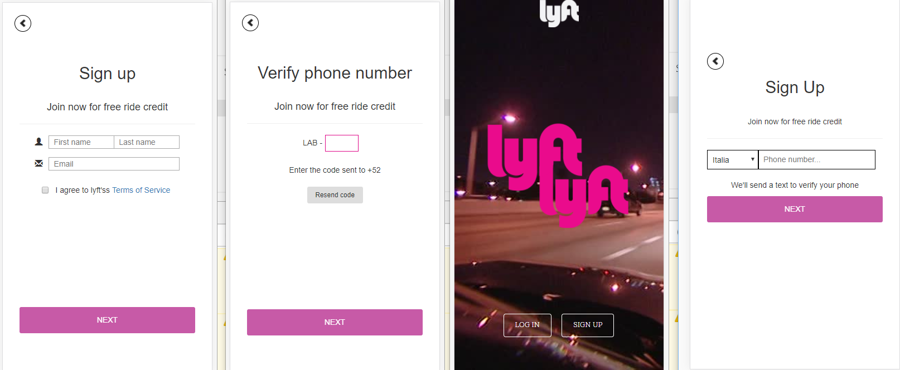

# Lyft-movil

***
## Se utilizó

`HTML`   `CSS` `Framework Bootstrap` 'jQuery'

## Descripción

Se trata de realizar un sistema de registro validando número de teléfono,
se manda un código aleatorio al usuario para que lo ingrese y pueda registrarse.
Luego valida nombre, apellido y correo electrónico guardando los datos. Todo
principalmente mediante jQuery.

## Trabajo terminado

## Especificaciones

* Esta web utilizó la tipografía: `Dosis`, `Quattrocento Sans`.
* Otros íconos pertenecen a Bootstrap - Glyphicons.

`Nota:`

*Este trabajo se ha subido a gh-pages [aquí](https://yaniraab.github.io/lyft-movil/).
